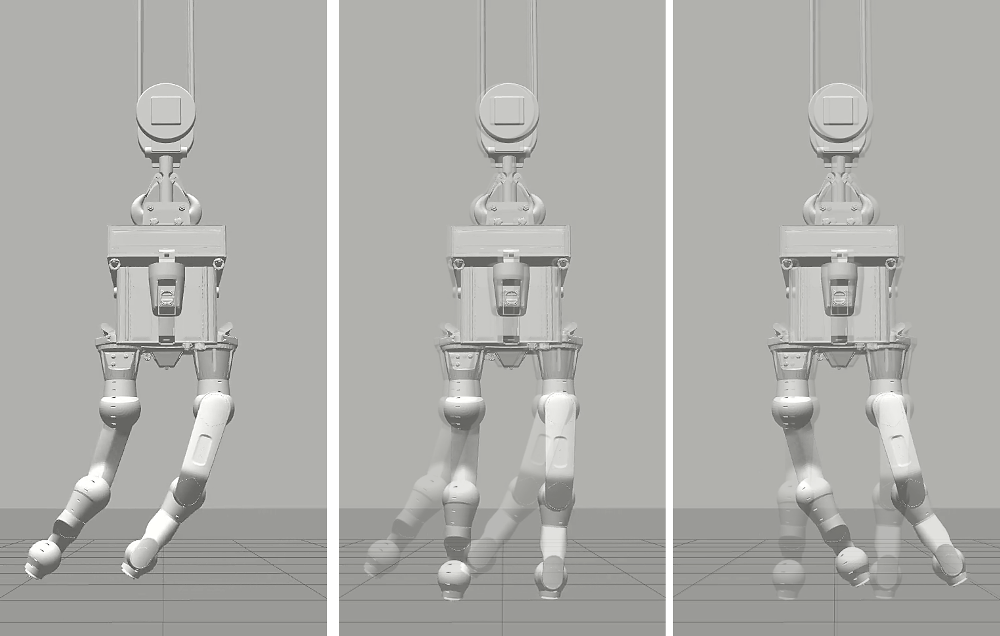

# Cable Suspended Robots

Environment and source code to simulate cable-suspended dual-arm manipulators developed in the paper:

*[G. D'Ago](), [M. Selvaggio](http://wpage.unina.it/mario.selvaggio/index.html), [A. Suarez](), [F. J. Gañán Onieva](), [L. R. Buonocore](), [M. Di Castro](), [V. Lippiello](http://wpage.unina.it/lippiell/), [A. Ollero](https://grvc.us.es/aollero/home_en.html), [F. Ruggiero](http://www.fabioruggiero.name/web/index.php/en/) "Modelling and identification methods for simulation of cable-suspended dual-arm robotic systems", in IEEE Robotics and Automation Letters, submitted.* 

# Instructions

The code was tested with Ubuntu 20.04, and ROS Noetic. Different OS and ROS versions are possible but not supported.

### Install dependencies

`sudo apt-get install ros-noetic-ros-control ros-noetic-ros-controllers`

### Compile

`catkin_make -DCATKIN_WHITELIST_PACKAGES=""`

### Run simulation CRANEbot

`roslaunch cable-suspended-robots-ros-pkg cranebot.launch`

`rosrun cable-suspended-robots-ros-pkg armsInducedOscillationCranebot.launch`

### Run simulation LiCAS

`roslaunch cable-suspended-robots-ros-pkg licas.launch`

`rosrun cable-suspended-robots-ros-pkg unforcedOscillationLicas.launch`
